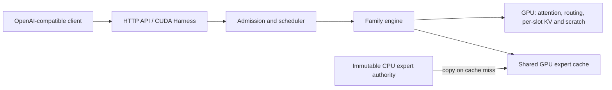

# TensorFold fork

This fork of [TensorFold](https://github.com/ashhart/TensorFold) serves language models on Apple Silicon and NVIDIA GPUs through an OpenAI-compatible API. It retains the upstream model families, family-specific kernels, exact speculative decoding, prompt reuse, tools, reasoning and vision support, and adds a reproducible NVIDIA container, Flash Next YaRN context extension, RAM-backed expert caching, optional RotorQuant KV formats, and service admission controls.

The maintained fork is [kklouzal/TensorFold](https://github.com/kklouzal/TensorFold), branch **`gb10-flash-next`**. The source shipped before this documentation refresh was `75dba8bb496477b5ebb4313e93bb18d7d9bf83b1`. Record the commit you actually clone: branch heads move. The fork is kept as a branch over upstream so upstream changes can be reviewed and merged.

**Validation status:** the performance results below describe completed, identified trials. The latest source has retained correctness fixes and configuration controls; fresh qualification of its final container, normal installed package and complete API is still in progress. Historical images and component/source checks do not establish that final qualification. Private performance experiments are not advertised as features.

## Start here

- [Build and run the NVIDIA container](#build-and-run-the-nvidia-container)
- [Install the fork on Apple Silicon](#apple-silicon-and-source-installation)
- [Supported models and formats](#supported-models-and-formats)
- [Configuration](#configuration)
- [RAM-backed expert cache](#ram-backed-expert-cache)
- [Context, RoPE and YaRN](#context-rope-and-yarn)
- [KV cache formats](#kv-cache-formats)
- [API and client behavior](#api-and-client-behavior)
- [Measured performance and tested hardware](#measured-performance-and-tested-hardware)
- [Benchmark, operate and update](#benchmark-operate-and-update)

## Platforms and runtime

| Target | Runtime and scope |
| --- | --- |
| Apple Silicon/macOS | MLX backend; Python 3.11 or newer. Package requirements currently constrain MLX to `>=0.32.2,<0.32.4` and mlx-lm to `>=0.31.3,<0.33`. |
| Linux/NVIDIA AMD64 | Native AMD64 container and CUDA backend. The separate-VRAM trials used an RTX PRO 2000 Blackwell with 16 GB VRAM and 64 GB system RAM. |
| Linux/NVIDIA ARM64 | Native ARM64 container and CUDA backend; earlier deployment trials used DGX Spark/GB10 unified memory. |

`--backend auto` selects MLX on macOS and CUDA elsewhere; model-family support still applies. The required native file-owner extension supports Linux and macOS. Native Windows is outside the current runtime contract.

The CUDA backend defaults to a compute-capability floor of **8.9** and refuses unsupported GPUs at startup. Individual kernels can require additional capabilities; cluster extensions require at least 9.0. Native NVFP4 checkpoint math requires SM 12.x, while FP8 math starts at 8.9; supported stored-weight BF16 paths apply where the GPU lacks the checkpoint's native math. Check [CUDA formats and qualification](docs/recipes/cuda.md), especially before assuming an untested Ada, Hopper or other Blackwell card has the same execution coverage as the measured machine. Build targeting alone is not hardware verification.

### Pinned container stack

The [Dockerfile](deploy/gb10/Dockerfile) builds from the NVIDIA NGC CUDA DL inference development image:

```text
nvcr.io/nvidia/cuda-dl-base:26.09-cuda13.4-inference-devel-ubuntu24.04@sha256:f86c199a302a3a7405d5f055adf1311cd660e85d8a66cf452be6eb45d5768639
```

The recorded **2026-10-06** stack is CUDA **13.4.1**, CPython **3.12**, PyTorch **`2.16.0.dev20261006+cu134`**, TorchVision **`0.30.0.dev20261006+cu134`**, Triton **`3.9.0+gitaad2a60d`**, and xgrammar **0.2.8**. These are reproducible pins, rather than a floating “latest” install. [ARM64 pins](deploy/gb10/nightly-pins.json) and [AMD64 pins](deploy/gb10/nightly-pins-amd64.json) contain separate child-image and wheel hashes; matching runtime/test lock files are installed with hash checks. Architecture selection rejects a mismatched native target.

The image includes the extension build toolchain and isolates compiler caches by architecture and CUDA/Torch/Triton identity. It contains no model weights. Install [Docker Engine](https://docs.docker.com/engine/install/), a compatible NVIDIA host driver, and the [NVIDIA Container Toolkit](https://docs.nvidia.com/datacenter/cloud-native/container-toolkit/latest/install-guide.html) first. The Toolkit guide covers `nvidia-ctk runtime configure --runtime=docker` and restarting the host Docker daemon; do that host setup before building or running the service. The compatibility launcher validates the effective driver/runtime environment. Forward compatibility on a tested GB10 driver does not establish support for every desktop driver.

## Build and run the NVIDIA container

The following example is for a **native AMD64 Linux host with a separate 16 GB GPU and 64 GB RAM**. It uses the tested Flash Next EXL3 checkpoint, a 2,048-token configured context, four shared decode slots, and a RAM-backed expert cache. Memory admission can still refuse a configuration that does not fit your actual host.

### 1. Clone and build

```bash
git clone --branch gb10-flash-next https://github.com/kklouzal/TensorFold.git
cd TensorFold
git rev-parse HEAD

TF_BUILD_JOBS=8
docker buildx build --platform linux/amd64 --load --target runtime \
  --build-arg SOURCE_REVISION="$(git rev-parse HEAD)" \
  --build-arg MAX_JOBS="$TF_BUILD_JOBS" \
  --tag tensorfold-fork:local --file deploy/gb10/Dockerfile .
docker image inspect tensorfold-fork:local --format '{{.Id}}'
```

Use `--platform linux/arm64` on a native ARM64 Docker host. Cross-building or resolving another architecture's dependencies does not verify its GPU execution. `SOURCE_REVISION` is a label: a build from an edited working tree is not proven identical to that commit.

`MAX_JOBS=8` is the bounded default for compiler jobs. To request all available CPU cores, set `TF_BUILD_JOBS="$(getconf _NPROCESSORS_ONLN)"` before building and use the same runtime environment variable below. Choose a lower value if compiler memory would compete with model loading. This configures the job limit; it does not prove all cores remain busy.

Check GPU visibility through the image's compatibility launcher:

```bash
docker run --rm --gpus all --entrypoint python3 tensorfold-fork:local \
  /opt/harness/cuda_entrypoint.py python3 -c \
  'import torch; print(torch.__version__); print(torch.cuda.get_device_name(0)); print(torch.cuda.get_device_capability(0)); print(torch.cuda.mem_get_info())'
```

### 2. Acquire a model at a known revision

Provide enough disk space for the complete checkpoint and downloads. The tested EXL3 snapshot contains approximately **62.8 GB** of assets, including the mapped n-gram file; that is different from its resident expert-weight requirement. Review the model's license. Supply Hugging Face authentication through your environment if the selected repository requires it.

The download below uses the image's installed [Hugging Face `snapshot_download` API](https://huggingface.co/docs/huggingface_hub/package_reference/file_download), requires network access, and does not require a GPU. Set both directories to absolute host paths; acquisition needs a writable model directory.

```bash
TF_MODELS=/absolute/path/to/tensorfold-models
TF_CACHE=/absolute/path/to/tensorfold-kernel-cache
mkdir -p "$TF_MODELS" "$TF_CACHE"

docker run --rm --entrypoint python3 \
  --mount "type=bind,src=$TF_MODELS,dst=/models" \
  tensorfold-fork:local -c \
  'from huggingface_hub import snapshot_download; snapshot_download(repo_id="turboderp/Qwen3.8-Flash-Next-exl3", revision="65c895314393431c09050b2e04e250836b3a6eb4", local_dir="/models/Qwen3.8-Flash-Next-exl3")'
```

For authenticated downloads, add `-e HF_TOKEN` after setting it in the host environment. Keep credentials out of logs and shell history. A different model or revision requires its own format, memory and quality checks. Model files must remain immutable while a service uses them.

### 3. Launch

```bash
docker run -d --name tensorfold-local --gpus all \
  --memory 56000000000 --memory-swap 56000000000 --pids-limit 512 \
  -p 127.0.0.1:8080:8080 \
  -e MAX_JOBS="$TF_BUILD_JOBS" -e HF_HUB_OFFLINE=1 \
  -e TENSORFOLD_NO_UPDATE_CHECK=1 \
  --mount "type=bind,src=$TF_MODELS/Qwen3.8-Flash-Next-exl3,dst=/model,readonly" \
  --mount "type=bind,src=$TF_CACHE,dst=/cache" \
  tensorfold-fork:local serve /model --name local \
  --host 0.0.0.0 --port 8080 --backend cuda --thinking-budget 0 \
  --parallel 4 --context 2048 --max-tokens 128 --vram-experts auto --kv-dtype int8 \
  --mtp-drafts 4 --mtp-confidence 0.5 --yarn-factor 2 \
  --max-http-connections 32 --max-pending-requests 8 --no-thinking

docker logs --tail 100 -f tensorfold-local
```

The **56,000,000,000-byte** limit is 56 decimal GB, about 52.2 GiB. Setting the same memory and swap limit [grants no additional swap budget](https://docs.docker.com/engine/containers/resource_constraints/). This is the tested host's budget, not a universal safe allocation. The caps **32** and **8** are example choices; both are uncapped by default. INT8 KV is an explicit memory/quality tradeoff; the default is BF16. MTP-4, confidence 0.5 and YaRN-2 are selected example settings, rather than the drafting defaults; default prefetch remains enabled. The historical rates below do not automatically apply to this launch. `--no-thinking` disables template reasoning for this simple example and can be omitted for models that use it.

The runtime entrypoint already invokes the compatibility launcher and the CUDA Harness. Its arguments must begin with **`serve MODEL`**, and the Harness requires **`--thinking-budget 0`**. Other CLI subcommands use the ordinary source installation described below. The container listens on `0.0.0.0` internally; the host publication above exposes it only on loopback. Change the host publication deliberately for remote clients and apply your service's access controls.

The image defaults to root. The model mount must be readable, and `/cache` writable, for whichever UID you select. Adding `--user` requires validating those permissions and home/cache access; generic rootless operation has not been qualified. Persist `/cache` across restarts so runtime extension compilation can reuse matching artifacts.

### 4. Verify readiness and actual generation

Loading and first-time compilation can take several minutes. Watch logs until startup completes, then inspect health and the advertised model ID:

```bash
curl -fsS http://127.0.0.1:8080/health
curl -fsS http://127.0.0.1:8080/v1/models
curl -fsS http://127.0.0.1:8080/v1/chat/completions \
  -H 'Content-Type: application/json' \
  -d '{"model":"local","messages":[{"role":"user","content":"Explain why the sky is blue in one short sentence."}],"max_tokens":64,"temperature":0,"chat_template_kwargs":{"enable_thinking":false}}'

curl -N -fsS http://127.0.0.1:8080/v1/chat/completions \
  -H 'Content-Type: application/json' \
  -d '{"model":"local","messages":[{"role":"user","content":"Write a short description of the Moon."}],"max_tokens":64,"temperature":0,"stream":true,"chat_template_kwargs":{"enable_thinking":false}}'
```

A healthy listener alone is insufficient: consume a complete generation. Check reported context, admission and cache information in health/logs before increasing capacity.

### GB10 Compose profile

[deploy/gb10/compose.yaml](deploy/gb10/compose.yaml) is a deployment-specific GB10 profile: a captured model path, 114 GiB memory, host CPU affinity, four slots and a 524,288-token YaRN-2 context. It is not a portable 16 GB GPU configuration. Review its memory, affinity, mounts, networking and flags before running it. `HF_CACHE`, `KERNEL_CACHE` and `TENSORFOLD_IMAGE` override its paths/image; its health check allows 15 minutes for initial compilation/loading. See the [deployment guide](deploy/gb10/README.md).

```bash
docker compose -f deploy/gb10/compose.yaml config --quiet
docker compose -f deploy/gb10/compose.yaml up -d
docker compose -f deploy/gb10/compose.yaml ps
docker compose -f deploy/gb10/compose.yaml logs --tail 100 -f tensorfold
```

Four slots share weights and an expert cache; they do not guarantee four simultaneous full-size contexts fit.

## Apple Silicon and source installation

Install **this fork**, rather than an upstream wheel or Homebrew release, to obtain its changes. On Apple Silicon, use a virtual environment with Python 3.11 or newer:

```bash
git clone --branch gb10-flash-next https://github.com/kklouzal/TensorFold.git
cd TensorFold
python3 -m venv .venv
. .venv/bin/activate
python -m pip install --upgrade pip
python -m pip install -e '.[grammar]'
tensorfold models
tensorfold info Vontra/NVIDIA-Nemotron-3.5-Lightning-30B-A3B-MLX-4bit
tensorfold pull Vontra/NVIDIA-Nemotron-3.5-Lightning-30B-A3B-MLX-4bit
tensorfold serve Vontra/NVIDIA-Nemotron-3.5-Lightning-30B-A3B-MLX-4bit --no-update-check
```

The native extension requires a working platform compiler. Add the `vision` extra for image input, or `ssd` for the supported SSD expert path, for example `python -m pip install -e '.[grammar,vision,ssd]'`. The grammar extra installs xgrammar; the pinned Docker runtime already includes it. On CUDA, use the container's matching Torch, Triton and extension compiler; the package has no `cuda` installation extra.

`tensorfold models` lists registered families/checkpoints. `info MODEL` checks configuration without fetching weights. `pull MODEL [DRAFTER ...]` downloads ahead of time; `serve` can download a missing checkpoint. The CLI download uses repository defaults; the revision-pinned API download above is preferable for reproducible deployments. See the [runbook](RUNBOOK.md) and [recipes](docs/recipes/README.md) for family-specific setup.

## Supported models and formats

The table describes supported integration paths. It is not a promise that every checkpoint fits a particular machine, or that all paths have been rerun on this fork's latest image. CUDA registers Qwen dense, Qwen3.6 MoE, Flash Next, Nemotron and GLM families; Gemma, Bonsai and DeepSeek listed here are MLX-only.

| Model | Example checkpoint | Backend | Drafting |
| --- | --- | --- | --- |
| Nemotron 3.5 Lightning | `Vontra/NVIDIA-Nemotron-3.5-Lightning-30B-A3B-MLX-4bit` | MLX, CUDA | Included MTP; context copies on MLX |
| Qwen3.8-27B dense | `Vontra/Qwen3.8-27B-MLX-4bit` | MLX, CUDA | `z-lab/Qwen3.8-27B-DFlash2`; optional on MLX |
| Qwen3.6-35B-A3B MoE | `Vontra/Qwen3.6-35B-A3B-MLX-4bit-MTP` | MLX, CUDA | Included MTP; see the [recipe](docs/recipes/qwen3.6-moe.md) |
| Qwen3.8 Flash Next | `Vontra/Qwen3.8-Flash-Next-MLX-4bit-MTP` | MLX, CUDA | Included MTP and context copies |
| GLM-5.3-Flash | `Vontra/GLM-5.3-Flash-MLX-4bit-MTP` | MLX on a 256 GB Mac; CUDA with two ranks | MTP; optional DFlash2 on CUDA |
| Gemma 4 26B-A4B | `mlx-community/gemma-4-26b-a4b-it-4bit` | MLX | Context copies; optional `z-lab/gemma-4-26B-A4B-it-DFlash` |
| DeepSeek-V4-Flash | `mlx-community/DeepSeek-V4-Flash-4bit` | MLX on a 256 GB Mac | `Vontra/DeepSeek-V4-Flash-DSpark-MLX` or `Vontra/DeepSeek-V4-Flash-MTP-MLX` |
| Qwen3.8-27B NVFP4 | `nvidia/Qwen3.8-27B-NVFP4` | CUDA, one GPU | DFlash2 and context copies |
| Qwen3.8-27B EXL3, experimental | `turboderp/Qwen3.8-27B-exl3`, branches `3.00bpw` / `4.00bpw` | CUDA | DFlash2 and context copies |
| Flash Next EXL3, experimental | `turboderp/Qwen3.8-Flash-Next-exl3`, branch `3.05bpw_h5_ng5` | CUDA | Included MTP and context copies |
| Ternary Bonsai 2 27B | `prism-ml/Ternary-Bonsai-2-27B-mlx-2bit` | MLX | `z-lab/Qwen3.8-27B-DFlash2` and context copies |
| Flash Next NVFP4 | `local-inference-lab/Qwen3.8-Flash-Next-NVFP4` or `RadixArk/Qwen3.8-Flash-Next-NVFP4` | CUDA, one GPU | Included MTP and context copies |

Dense Qwen reads affine 2/3/4/5/6/8-bit checkpoints, including mixed layers and groups 32/64/128; newer paths retain their documented hardware-qualification limits. Flash Next's affine path requires 4-bit/group-32 weights. Its EXL3 path reads per-tensor codebook widths; supported NVFP4 exports and block-scaled FP8 linears have separate checks. Flash Next without an MTP head needs `--no-drafts` on CUDA. Nemotron CUDA uses 4-bit/group-64 weights and requires its MTP head unless serial decoding is selected.

GLM reads affine 4-bit/group-64 and supported mixed-bit MLX conversions; CUDA also has the experimental `Mia-AiLab/GLM-5.3-Flash-EXL3-TR3-4bpw` path. Its optional `incoai/GLM-5.3-Flash-DFlash2` has non-commercial terms. Gemma uses 4-bit/group-32 or 64 with an 8-bit router and refuses other layouts. DeepSeek uses affine 4-bit/group-64 plus MXFP4 experts and the converted DSpark/MTP heads. Model weights and draft models keep their own licenses. Consult [quantized checkpoints](docs/quantization.md), [third-party notices](THIRD_PARTY_NOTICES.md) and the [family recipes](docs/recipes/README.md).

### Exact speculative decoding and concurrency

Drafting accepts a token only when it equals the same engine's serial choice. Sampling keys use the prompt or explicit seed, absolute position and token ID. Compare an otherwise identical request with `"draft": false` to check the serial reference.

Exactness is scoped to the **same engine, weights, runtime, precision, KV format and request settings**. It does not promise bit identity between MLX and CUDA, different weight/KV quantizations or tensor-parallel layouts.

MLX shares rounds across supported requests, with per-request state and sampling keys; load-time checks restrict families that cannot reproduce their serial arithmetic. CUDA explicit `--parallel N` enables shared rounds for Qwen dense on one/two ranks and Flash Next/Qwen3.6 MoE on one rank. Flash Next rejects concurrent two-rank execution. GLM and Nemotron CUDA are serial; CUDA `--parallel auto` means one. Qwen dense, Flash Next and Nemotron have one/two-rank CUDA paths; GLM requires two. A real two-GPU deployment needs separate qualification; a one-rank NCCL check does not establish it. See [two-rank setup](RUNBOOK.md#nvidia-gpus).

## Configuration

Use `tensorfold serve --help` from your checkout for the authoritative parser. A request can override supported generation defaults. Unsupported backend/family combinations are refused; a listed flag is not available for every model. GiB flags use binary GiB; Docker's example RAM limit above uses bytes.

### Service, generation and admission

| Flags | Default / contract |
| --- | --- |
| `-h`, `--help` | Show serve help. |
| `--backend auto\|mlx\|cuda` | `auto`: MLX on macOS, CUDA elsewhere. |
| `--host`, `--port` | `127.0.0.1`, `8080`; container port publication needs `--host 0.0.0.0` inside. |
| `--name`, `--alias` | Model's own name; aliases are repeatable additional IDs on both backends. |
| `--max-http-connections N` | Unset: uncapped workers. Positive cap includes active/idle keepalive connections; at capacity acceptance pauses and connections wait in the existing listen backlog. |
| `--max-pending-requests N` | Unset: uncapped. Positive cap counts unfinished logical generation requests, including preparation, queued/running work and work retained after cancellation. Excess receives HTTP 503 before a configured stream opens. |
| `--max-engine-calls N` | MLX only; unset: uncapped. Positive cap counts queued/running engine RPC callbacks, including callbacks retained after caller timeout. CUDA refuses it. |
| `--context N` | Omitted: fitted model capacity. CUDA omitted/0 targets affordable native capacity; MLX 0 removes the metadata cap, while finite memory/engine limits remain. |
| `--max-tokens N` | `4096` when a request does not specify a reply limit. |
| `--temperature`, `--top-p`, `--top-k`, `--min-p` | Checkpoint `generation_config.json`; temperature falls back to 0, min-p to 0. Temperature 0 is greedy. |
| `--thinking`, `--no-thinking` | Thinking enabled by default when the template supports it. |
| `--reasoning-effort low\|medium\|high\|xhigh` | Template default when unset; unnamed levels map to the nearest named level, ties upward. |
| `--thinking-budget N` | `0`: no limit. Positive budgets close the reasoning block at the limit; the container Harness requires the CLI value 0. |
| `--no-update-check` | Off by default; `TENSORFOLD_NO_UPDATE_CHECK=1` also disables the startup upstream-release check. Recommended for this fork. |
| `--trust-model-code` | Off by default. MLX provider recipes: explicitly allow checkpoint Python to execute with server privileges; persistent cache identity becomes process-specific. |

Caps bound owner counts, not arbitrary total payload bytes. Generated token buffers remain bounded by each accepted prompt/reply/context contract; a trusted internal RPC callback may allocate its own payload. Canceled callers retain admission until their owned engine work retires. On MLX, direct scoring/cache-warm jobs also consume pending-request admission. Choose limits from measured demand and memory, rather than assuming the example values are defaults.

### Drafts, parallelism and precision

| Flags | Default / contract |
| --- | --- |
| `--parallel N\|auto` | `auto`: MLX up to 8 while projected memory fits; CUDA 1. Explicit shared-round support is family/rank-specific. |
| `--no-drafts` | Off; opt in to the same-engine serial reference. |
| `--drafter auto\|none\|MODEL` | `auto`: a supported family drafter when already pulled. Dense Qwen CUDA needs the drafter pulled or explicit `--no-drafts`. |
| `--drafter-bits N` | `4`; 0 retains BF16 draft linears. |
| `--mtp-drafts N` | Family-specific; Flash Next defaults to 3 on MLX and up to 6 on CUDA. 0 disables MTP drafts. |
| `--mtp-confidence P` | Flash Next CUDA default `0.70`; range 0–1, stops later low-confidence drafts. |
| `--lane-kernels auto\|on\|off` | `auto`; Qwen dense lane kernels on GPUs with tensor units. |
| `--decode-share F` | MLX default `0.25`, leaving replies progressing during chunked prefill. Flash Next CUDA shared rounds default 0; a positive share sizes prompt passes to allow decoding inside them. |
| `--prefill-fp8`, `--no-prefill-fp8` | CUDA supported prompt kernels; default BF16 activations. FP8 prefill explicitly reduces activation precision. |
| `--precision checkpoint\|full` | CUDA NVFP4 default `checkpoint`: checkpoint-native math when supported, with the documented stored-weight path otherwise. `full` uses BF16 activations against stored weights. |
| `--tp 1\|2`, `--rank 0\|1` | Defaults 1/0. Two ranks run the same checkpoint/configuration on both hosts; rank 0 serves HTTP. |
| `--master HOST`, `--master-port P` | Two-rank rendezvous; port defaults to `29551`. |

FP8 prefill, checkpoint-native low-precision activation math, weight quantization, KV quantization and YaRN are **quality choices**. A quality-preserving speed comparison must keep the chosen numerical contract fixed. See [prompt precision](docs/recipes/cuda.md#prompt-precision) and [NVFP4 precision](docs/recipes/cuda.md#nvfp4-precision).

### Cache, memory and vision

| Flags | Default / contract |
| --- | --- |
| `--vram-experts GIB\|auto` | Unset: resident experts. Flash Next affine 4-bit/group-32 or EXL3 CUDA, one GPU; bounded shared VRAM expert cache backed by system RAM. |
| `--ssd-experts GIB` | Unset. Supported MLX families stream checkpoint experts into a GPU pool; distinct from RAM-backed CUDA experts and unsupported with CUDA `--vram-experts`. See the [Flash Next recipe](docs/recipes/qwen3.8-flash-next.md). |
| `--ple-on-ssd` | Off. Supported Flash Next affine n-gram tables use demand SSD reads. EXL3 uses its native mapped n-gram table and rejects this flag. |
| `--kv-dtype FORMAT` | Flash Next CUDA `bf16`; shorthand selects both K and V formats. |
| `--kv-key-dtype FORMAT`, `--kv-value-dtype FORMAT` | Unset; independently override their side of `--kv-dtype`. |
| `--yarn-factor FACTOR` | Flash Next CUDA: checkpoint factor unless overridden; finite factor ≥1. `--context` still governs admission. |
| `--prompt-cache-gib N` | MLX retained-prefix budget; 0 disables retention. Default is idle room after weights/window/shared round, normally at least an eighth of RAM up to 16 GiB, given back on demand. |
| `--checkpoint-slots N` | MLX: default 3 prefixes per lane, at least 8. CUDA Qwen dense with parallel ≥2: default 3 retained prompt states, subject to its rank/memory policy. |
| `--spill-gib N` | MLX, default 0. Disk capacity for evicted conversation prefixes; needs `--snapshot-dir`. |
| `--snapshot-dir DIR` | MLX, default `~/.cache/tensorfold/prefix-snapshots`; `none` disables persistent snapshots. |
| `--max-snapshots N` | MLX, default 3 system-block snapshots loaded at startup. |
| `--prefill-pass N` | MLX, default 8 prompt chunks per forward for families with a prompt pass. |
| `--pass-cache-gib N` | MLX, default 16 GiB freed-buffer cache during a prompt pass when budget permits. |
| `--mlx-cache-gib N` | MLX, default 8 GiB reusable freed-buffer cache. |
| `--vision` | Off. GLM on MLX, Qwen dense on MLX/CUDA, and Flash Next CUDA with parallel ≥2, with supported vision checkpoints. |
| `--vision-urls` | Off; image data URLs only by default. Opt in to public HTTP(S) URLs; URL safety policy still applies. |
| `--vision-max-images N` | Effective default 4 across the full history; byte, pixel and visual-token limits also apply. |

Image input requires the `vision` extra in a source installation. The API accepts text/image parts; the CUDA Harness reports its supported image/video capabilities. See [vision contracts and qualification](docs/vision.md) and the [Harness/deployment guide](deploy/gb10/README.md). Enabling vision can add workspace and reduce the room available for experts or context.

## RAM-backed expert cache

The service separates HTTP ownership, generation scheduling and model execution. In the CUDA container, the Harness adds token counting around the native API. The diagram shows the Flash Next `--vram-experts` mode: mandatory state remains on the GPU and the expert cache receives unchanged CPU weights on misses.



`--vram-experts` lets a supported Flash Next model keep its routed expert authority in pageable **system RAM**, with a bounded cache of unchanged packed expert weights in VRAM. Frequently reused experts stay cached through bounded aging LFU, with recency and physical-slot tie-breaking. The same cache is shared by all generation slots.

Attention, routing and required non-expert weights stay on the GPU. Each slot's KV cache, recurrent state, retained snapshots and scratch/workspace also consume GPU memory. A miss stages and uploads the original quantized expert bytes **before the GPU computes with them**; the current implementation does not compute directly against weights in system RAM. Cache residency changes IO cost, not expert selection or precision.

| Mode | Behavior |
| --- | --- |
| Omit `--vram-experts` | Ordinary resident expert loading. |
| `--vram-experts 6` | Limit packed GPU expert storage to 6 GiB, rounded down to whole cache cells. Mandatory model/state/workspace allocations are additional. |
| `--vram-experts auto` | On separate-VRAM CUDA GPUs, assign remaining usable VRAM after resident allocations, full configured slot/KV/MTP/snapshot/workspace reservations and one **512 MiB** margin. |

The cache capacity is fixed for the engine's lifetime. Restart after changing context, slot count or its budget. `auto` does not promise every reported VRAM byte becomes cache; mandatory allocations and headroom remain. The weights are shared across slots, but slot state is not, so more slots can reduce cache capacity. Host expert authority must fit the host budget alongside mapped n-gram pages, preparation, transfers and the rest of the process.

The path requires a supported single CUDA GPU with compute capability ≥8.9. It refuses NVFP4, tensor parallelism, MLX and other model families. `auto` requires separate VRAM; unified-memory systems use a numeric budget if this path is appropriate. It is distinct from `--ssd-experts`.

Default EXL3 n-gram prefetch reads the mapped table. Page locking is optional and admitted against host/cgroup/device capacity; refusal leaves mappings pageable and evictable while preserving normal prefetch. There is no public `--no-prefetch` flag. The tested checkpoint has **30,948,556,800 bytes** of CPU expert authority and a **26,240,125,952-byte** native mapped n-gram file. Cached file pages consume system RAM even though the OS can reclaim them. See [RAM-backed experts](docs/recipes/ram-experts.md) for accounting, metrics and limitations.

## Context, RoPE and YaRN

Context means **prompt plus reply**, not reply length alone. An explicit reply limit is reserved before prefill; an omitted reply limit is capped by remaining context. Startup reports native/extended limits and affordable engine capacity. A positive configuration that cannot fit is refused rather than silently making all slots usable at that length.

Flash Next CUDA supports static YaRN text RoPE extension. For a checkpoint with native 262,144-token metadata:

```text
--yarn-factor 2 --context 524288
```

This requests a 2× RoPE limit and admission window. It is **not a fit guarantee**, and it is unsuitable as the starting configuration for the 16 GB GPU example. YaRN can change short- and long-context quality; validate your intended tasks. The separate-VRAM performance trials below configured only 2,048 tokens with factor 2. A previous GB10 deployment has a bounded 524k retrieval record in its [deployment guide](deploy/gb10/README.md); one retrieval is not a general long-context accuracy guarantee or qualification of the latest image.

CUDA omitted/0 context targets affordable native capacity. GLM's default target is a dense 2,051-token window; Nemotron's is 16,384; admission may lower them. MLX omitted context fits the metadata window to startup estimates, while 0 removes only the metadata cap. Use the **reported effective context** for client compaction.

A slot includes engine-specific growth and draft rows: the observed 2,048-token Flash Next/MTP-4 setup had 2,053 cache slots, not exactly 2,048 allocated rows. Shared weights do not remove those per-slot costs.

### MLX memory and prompt reuse

MLX normally uses a process budget of 70% of physical RAM. GLM may use 85% on a Mac with 256 GB or less. `TENSORFOLD_MEMORY_LIMIT_GB` overrides the share in **GiB**, within physical/working-set limits. A 3 GiB process reserve precedes the allocator budget. Admission includes weights, growing contexts and workspace; fitting weights alone is insufficient. Concurrent streams grow in bounded increments and can wait when projected memory is insufficient without changing their tokens.

MLX prompt chunks follow rendered token sequences and recognized message boundaries; otherwise a family-specific grid applies. Fresh and resumed prompts use the same plan. Reuse stops at an exact matching prefix and valid boundary; templates that rewrite history can reduce reuse. There is no `--prefill-grid` option.

Persistent prefix snapshots use format 2 and explicit current-model registries. Malformed, legacy, mismatched or unregistered snapshots rebuild through ordinary prefill. Stored class names do not import code. Snapshot identity hashes selected model/draft trees and installed runtime inputs, including native libraries; model inputs must remain immutable. Explicitly trusted checkpoint Python uses a process-specific namespace. `--snapshot-dir none` disables persistent reuse and these persistence hashes. CUDA engines own separate prompt states and do not use MLX disk snapshots. See the [recipe book](docs/recipes/README.md).

## KV cache formats

Flash Next CUDA supports the following **16 formats**, with independent K/V selection; **BF16 is the default**. `--kv-dtype` selects both sides; `--kv-key-dtype` and `--kv-value-dtype` override only their respective side. All **256 ordered combinations** are selectable when head geometry supports them; this is configuration support, not a completed quality/performance matrix for all combinations.

| Family | Exact names | Bytes for one 256-value K **or** V head |
| --- | --- | ---: |
| BF16 | `bf16` | 512 |
| INT8 | `int8` | 272 |
| INT4 | `int4` | 144 |
| RotorQuant 3-bit | `rotorquant-planar3`, `rotorquant-iso3` | 104 |
| RotorQuant 4-bit | `rotorquant-planar4`, `rotorquant-iso4`, `rotorquant-iso64-norm4`, `rotorquant-signed128-4`, `rotorquant-signed64-norm4` | 136 |
| RotorQuant 6-bit | `rotorquant6`, `rotorquant6-norm`, `rotorquant6-outlier-norm` | 200 |
| RotorQuant 7-bit | `rotorquant7` | 232 |
| RotorQuant 8-bit | `rotorquant8`, `rotorquant8-norm` | 264 |

Add K and V storage, multiply by KV heads, and include unchanged BF16 indexer/pooled state, MTP, workspace, status and snapshots for total memory. INT8/INT4 use an FP16 scale per 32 values and require head dimensions divisible by 32. Rotor formats use packed Lloyd-Max codes and one FP32 scale per 128 values; norm/outlier variants store a corrected scale rather than necessarily the original RMS. Their head dimension must be a power of two divisible by 128.

Examples, to add to a compatible launch:

```text
--kv-dtype bf16
--kv-dtype int8
--kv-dtype rotorquant6-norm
--kv-dtype bf16 --kv-key-dtype rotorquant6-norm --kv-value-dtype int8
```

**Quantized formats can change output.** Compression, quality and speed are user tradeoffs; there is no BF16-equivalence claim. Planar rotations mix pairs, iso formats use quaternion blocks, and signed formats use fixed signs/mixing. Norm variants correct reconstruction energy; the outlier variant changes its scaling/code selection. Equal bit width does not make codecs interchangeable. Changing either side requires a fresh engine/cache; an unsupported format is refused, never silently substituted.

The implementation is TensorFold-owned scalar Gaussian Lloyd-Max quantization with pinned orthogonal rotations, informed by review of [scrya-com/rotorquant](https://github.com/scrya-com/rotorquant) at commit `fcd76768650659cad2f40a45a330612a7af8f928`. It does not import upstream cache/kernel bytes. Provenance, transform/numerical contracts and validation limits are in [the KV recipe](docs/recipes/qwen3.8-flash-next.md#kv-cache), [reference source](src/tensorfold/families/qwen4_exp/cuda/rotorquant_ref.py), [kernel source](src/tensorfold/families/qwen4_exp/cuda/rotorquant_kernel.py), and [third-party notices](THIRD_PARTY_NOTICES.md). The maintained source now includes a seven-bit decoder lookup optimization only within the [controlled region measured below](#controlled-rotorquant7-decoder-comparison). It preserves the chosen same-format output contract; it does not change model weights or KV quantization. It uses the existing internal selection policy, with no new public flag. Default full-prefetch serving and conditions outside that measured region retain the original decoder. Frozen selected-source shipping qualification is complete; see [the shipping results](#frozen-source-shipping-qualification).

## API and client behavior

Use `http://127.0.0.1:8080/v1` as an OpenAI-compatible client base URL and an ID returned by `/v1/models`. The [API reference](docs/api.md) defines request fields, supported extensions and errors.

| Endpoint | Purpose |
| --- | --- |
| `GET /health` | Readiness, effective configuration and configured admission counters. |
| `GET /v1/models` | Advertised model IDs/aliases. |
| `GET /metrics` | Prometheus-compatible service metrics. |
| `POST /v1/chat/completions` | Chat, tools, reasoning, optional image input and SSE. |
| `POST /v1/completions` | Legacy text completions, including streaming. |
| `/v1/responses` | OpenAI Responses-style input/output and typed streaming; documented storage operations. |
| `POST /v1/tokenize` | CUDA Harness extension: native chat prompt counting without generation, including supported image expansion. |

Structured output uses xgrammar: supported `response_format` JSON/schema fields, `guided_json`, `guided_regex`, `guided_choice`, `guided_grammar`, and `structured_outputs` aliases. It works with supported draft verification. Malformed/uncompilable constraints, a missing dependency, or incompatible required-tool/grammar combinations are refused before generation. A minimal constrained request is:

```bash
curl -fsS http://127.0.0.1:8080/v1/chat/completions \
  -H 'Content-Type: application/json' \
  -d '{"model":"local","messages":[{"role":"user","content":"Return the allowed answer."}],"max_tokens":16,"temperature":0,"guided_choice":["TFOK"],"chat_template_kwargs":{"enable_thinking":false}}'
```

Flash Next CUDA probability output is supported on one GPU for **non-streamed text chat with thinking off**, without tools, stop strings, grammar or a thinking budget. `logprobs` and `top_logprobs` (0–20) report the raw temperature-1 target distribution before sampling filters, including under drafting. `return_token_ids` independently returns the generated token IDs. Unsupported combinations return a validation error. See the API reference for backend differences.

`ignore_eos` is a boolean; it does not disable explicit stop strings. EOS/stop completion reports `stop`, while reply-budget exhaustion reports `length`. Returned token IDs and usage can include a hidden EOS token even when displayed text does not. Tool/reasoning fields follow the selected model's template; not every family supports the same template behavior.

Chat/completion streaming uses SSE `data` events, optional usage and `[DONE]`; Responses uses typed events. A failure after a stream opens is an error event rather than a new HTTP status. CUDA validates its context before opening SSE; default MLX context refusal can occur after opening, while configured admission defers headers to return capacity errors as JSON first.

Closing a client socket cancels its live request. Ordinary one-GPU CUDA stops at the next round; some two-rank Flash Next, Nemotron and GLM requests finish on both ranks. Queued cancellation must not start new engine work, and admission is held until retained work actually retires. Deleting a stored Response deletes storage; it is not a live-generation cancellation API. Idle health should show zero logical requests, but its own connection counts toward a configured HTTP cap.

On Linux, the measured transport policy enables TCP_NODELAY once a connection successfully parses a reusable request after its first operation. Fresh/connection-close operations retain the stock setting; untested Apple transport retains stock parsing. This is a bounded HTTP transport result, not an LLM tokens/s claim.

## Measured performance and tested hardware

The principal separate-VRAM trials used **RTX PRO 2000 Blackwell (SM 120), nominal 16 GB VRAM / 64 GB system RAM**, on native AMD64 Linux. Observed physical GPU memory was 16,584,343,552 bytes; one intermediate-image startup probe reported 15,868,952,576 bytes available to the job. Available memory changes with other users and allocations.

### Current default-prefetch reference

A later qualification used the normal installed Source06 image **`sha256:cf99e0cf0ab8007f0cfcad962c7df3aac8a845f743619fa9e3616239b8847a08`**, source UID `0b6aa865d82a70e5b2633e90c6ad3e8c7670579f45a078b235f904e81ca48c2e`, and wheel `80f1c23f390da93ead7a88928f3b19b0448508567c5e95464c7b9940d8c9842e`. It used the same pinned EXL3 checkpoint below, automatic expert caching, configured context **2,048**, **four slots**, **INT8 KV**, **YaRN factor 2**, eager forwards, **full default n-gram prefetch**, and MTP-4 with confidence 0.5 when drafts were enabled.

Rates measure the complete, consumed public `Engine.generate` operation with synchronized GPU completion; first-token and stall timings come from its generation callbacks. HTTP client timings require their own benchmark.

| Consumed Engine generation workload | Observed median tokens/s | Observed first-token p95 | Observed emission-stall p99 |
| --- | ---: | ---: | ---: |
| Serial greedy, drafts off | 11.74 | 0.796 s | 0.089 s |
| One MTP request | 21.94 | 0.104 s | 0.152 s |
| Four concurrent MTP requests, aggregate | 82.39 | 0.170 s | 0.157 s |

Each row describes **20 warmed short-prompt trials across two stock-policy process starts**, with 64 output tokens per request. The four-request rate is aggregate throughput, not each user's rate. All 308 requests across the four qualification starts matched their original teacher under the chosen INT8/EXL3 contract. Each start completed full n-gram prefetch; optional table pinning was refused and the table remained pageable. The jobs stayed within the **56 decimal GB RAM / no-swap budget** and **15,868,952,576-byte GPU grant**, and retired their engine, cache, scheduler and process owners cleanly.

The observed sampled cgroup RAM peak across those starts was approximately **46.595 GB**; Torch reported peaks of **14.002 GB allocated** and **14.321 GB reserved** GPU memory. The two stock-policy constructors took **244.37 s** and **241.21 s**. These short, warmed observations do not establish a speedup over the historical comparison below, sustained full-context capacity, broad answer quality or performance for a future image. That Source06 image's completed CLI/API qualification is recorded below. The notification comparison retained the original policy for all three tested workloads. A separate full-request optional expert-arena comparison also retained the fixed expert-cache policy: no repeatable improvement was established, and the timed trials did not contain a successfully active arena loan. The separate aggregate-room-clipping diagnostic was inapplicable in the measured workload: its formula selected the original full size in all 1,320 observations, with one allocation success, 1,319 classified native OOM refusals, no aggregate precheck refusal and no positive strict-partial-room opportunity. No smaller arena was allocated, and the underlying refusal cause was not diagnosed. The original fixed-cache policy remains selected; no arena-lending or clipping path is retained. The selected seven-bit decoder comparison below uses a separate controlled workload; its results are not added to these stock figures. Frozen selected-source shipping and packaging qualification is complete below; these stock observations retain their Source06 identity.

### Controlled RotorQuant7 decoder comparison

The same RTX PRO 2000 Blackwell/SM 120 system and pinned runtime compared the Source06 original image above with lookup image `sha256:91c52073a666411b208befc775ecd09ebdce6cb23d0a4e02f2459454dd95a9e6`, source UID `26e9246f33df05a961cd9162615c9e5222a9359a908186cc9bff612ebea89af0`, wheel `113b2359ec603ef79f9b77ba36959abe9628b912bf5960a261ba3beb60ad88c0`. This is a completed controlled comparison with its own image identity, separate from the frozen shipping artifacts below.

The selected region is **plain symmetric `rotorquant7` (codec 4), 256-value heads**, the pinned EXL3 checkpoint, automatic expert caching, context **2,048**, four allocated slots but **one logical request**, YaRN-2, MTP-4/confidence 0.5 when drafts are enabled, eager forwards, **prefetch disabled**, one GPU, no vision and ordinary foreground, unconstrained generation without logprobs under the canonical greedy policy (`sampling=None`). The existing request predicate also excludes waiting, copy, background, owed-token and carry states. Other runtimes/hardware, shapes, asymmetric or other codecs, concurrent requests, sampling policies, graphs and default-prefetch operation retain the original decoder. There is no public prefetch-disable or decoder-selection flag.

| Complete-request Engine generation workload | Original median tokens/s | Lookup median tokens/s | Paired geometric TPS ratio |
| --- | ---: | ---: | ---: |
| Serial greedy, drafts off | 11.3018 | 11.6589 | 1.0330718 |
| One MTP request | 22.2929 | 22.8707 | 1.0223724 |

Each row uses **20 matched 64-token trials across four balanced process starts, two per arm**. Complete-request and consumed-decode gains appeared in both run-order halves, with unchanged expert-cache traffic and all declared resource/retirement gates passed. The quality gate matched **128 generated tokens and all 1,352 ordered same-format score/state/attention/pending/confidence records exactly** under actual serial/MTP dispatch; native and composed source/image provenance also passed. This is not BF16 equivalence or a general answer-quality comparison.

Only two starts per arm were measured. Trial-level conditional intervals do not establish population confidence; independent two-process-contrast t1 intervals include 1: **0.999460–1.067814 serial** and **0.966796–1.081144 MTP**. The selection is confined to the measured existing policy, with no universal gain, four-concurrent or full default-prefetch claim. Frozen selected-source shipping build/audit, packaging and API qualification is complete below; the performance table retains its measured comparison identities.

### Historical compact-cache comparison

The model was `turboderp/Qwen3.8-Flash-Next-exl3` revision **`65c895314393431c09050b2e04e250836b3a6eb4`**. The intermediate compact-cache comparison used the pinned CUDA 13.4 nightly stack, configured context **2,048**, four slots, **INT8 KV**, **YaRN factor 2**, eager forwards, **prefetch disabled in the controlled comparison**, and MTP-4 with confidence 0.5. This differs from current default-prefetch operation. RAM was capped at 56 decimal GB with no swap; the prompt was 46 tokens and each measured reply 64 tokens.

| Complete-request workload | Original median tokens/s | Compact cache median tokens/s | Paired geometric mean gain | Conditional 95% ratio interval |
| --- | ---: | ---: | ---: | --- |
| Serial greedy, drafts off | 8.09 | 11.64 | 43.9% | 1.4316–1.4458 |
| Serial MTP | 12.76 | 21.95 | 71.7% | 1.7089–1.7261 |
| Four concurrent requests, aggregate | 48.82 | 81.71 | 67.7% | 1.6687–1.6847 |

The original image was `sha256:afed8f340bba01d2333d2408faeb2daf9d3209c7411cc0a87482bccf7bed0387`; the compact image was `sha256:fb20eb4c7c55018c93f889c1705bdc4b8d56a3dd2845f3dc4e509b45eedc5fdc`. These are historical comparison identities, not the current final image.

All **240 timed requests** matched their **64-token serial teacher** exactly under the chosen INT8/EXL3 contract. There were 20 paired trials per workload inside four ABBA-ordered processes, with only two process starts per arm. The intervals assume independent paired log-errors, are conditional on those starts and do not account for process clustering; the three intervals are unadjusted, not population guarantees. Observed first-token p95 fell from 1.230→0.800 s, 0.138→0.102 s and 0.210→0.173 s respectively; observed emission-stall p99 fell from 0.133→0.090 s, 0.288→0.153 s and 0.289→0.160 s.

The compact arm's observed **sampled cgroup RAM peak** was approximately **45.213 GB**; Torch reported peaks of **14.002 GB GPU allocations** and **14.321 GB reserved GPU memory**. It reduced transferred expert bytes per output token by 52.3%, 60.9% and 61.4% in those workloads. Constructor startup was slower in that comparison: original 225–228 s versus compact about 280 s. These results do not establish cold-prefill speed, BF16-versus-quantized answer quality, sustained four-full-context capacity or latest-image performance.

Separate completed controls include same-format sampling/drafting/grammar/logprob equality, a header-only EXL3 constructor comparison with a **17.17%** conditional reduction, and complete HTTP metadata operations where Linux reused connections improved while fresh-connection differences remained uncertain. They use distinct workloads/source identities and must not be added together as one speedup. The transport result is not model throughput. Exact conditions, intervals, startup costs and remaining gates are in [optimization validation](docs/optimization-validation.md) and [RAM experts](docs/recipes/ram-experts.md).

Earlier native ARM64 **GB10/SM 121** trials are documented in the [deployment guide](deploy/gb10/README.md). Upstream's historical 64 GB M5 Pro/MLX memory results are preserved in the [Qwen recipe](docs/recipes/qwen3.8-27b.md#a-64-gb-m5-pro-on-0351); they are from TensorFold 0.3.5.1/MLX 0.31.2, not this fork's current qualification. Real two-GPU, new Apple runtime, every KV pairing, every head shape and general 524k-context quality remain separate coverage questions. Source checks, one-rank NCCL checks and cross-target compilation are not substitutes.

### Additional exercised checkpoints

These checks identify their executed image and scope. The NVFP4 row qualifies the recorded image's public constructor; the other rows retain their historical scope. They do not establish coverage or generation speed for other models.

| Checkpoint and revision | Hardware / tested image | Completed scope |
| --- | --- | --- |
| `mlx-community/Qwen3.5-9B-MLX-4bit`, `938d8919941c6e7efd3c7150eff7fe9d12afa631` | RTX PRO 2000 Blackwell; intermediate `fb20…` image above | Original CUDA replay/profile, context 512, row widths 1 and 16. No full-generation/TPS claim. |
| `turboderp/Qwen3.8-27B-exl3`, `5fce94d8233690102891329ac3dfca626ece4807`, selected `2.00bpw` | Same separate-VRAM host and `fb20…` image | Original CUDA replay/profile with native per-tensor codebook widths, context 512, row widths 1 and 16. No full-generation/TPS claim. |
| `RishabhSinha/Qwen3.5-9B-NVFP4`, `d51f8fa57a09df7d91a2d84017b7f7cb310887da` | RTX PRO 2000 Blackwell, 16 GB VRAM / 64 GB RAM; normal Source06 `cf99…` image above | Public constructor without admission/loader/precision hooks, context 512, one stream, max row width 16, drafts off, BF16 KV, FP8 prefill off and the default 4 GiB reserve. Each of `full` and `checkpoint` produced nine 64-token generations exactly matching its own-mode prior teacher. Checkpoint/model bytes remained unchanged; model allocations and reservations returned to zero on close. `full` disabled native FP8/NVFP4 math; `checkpoint` enabled both. No paired speedup, cross-precision equality or broader quality claim. |
| `TensorFold/Qwen3.8-Flash-Next-MLX-4bit-MTP`, `2b170fa6309d5d1ee380b35636075fac7945f286` | GB10/SM 121, 128 GB unified memory; historical deployment | Resident-weight API/restart, four-concurrent/repeated, tool/vision/video checks. YaRN-2 had one bounded 523,882-token prompt plus 18-token retrieval; see the deployment guide for limits. |

### Current installed CLI/API qualification

The ordinary installed PID-1 CLI and HTTP server in the same Source06 `cf99…` image passed seven functional groups on the 16 GB Blackwell / 64 GB RAM host. This used automatic expert caching, full default prefetch, context **2,048**, **four slots**, **INT8 K/V**, YaRN-2, eager execution, BF16 prompts and MTP-4/confidence 0.5. The configured admission limits were **five unfinished requests** and **32 HTTP connections**; these are test values, not the defaults.

The checks covered repeated serial/drafted generations with token IDs and exact log-probabilities, the legacy completion endpoint, xgrammar's `TFOK` choice followed by actual EOS, a 16-token `ignore_eos` request, and malformed/incompatible requests rejected as JSON HTTP 400 before SSE. The `ignore_eos` case demonstrates the recorded length result; it does not prove suppression of an EOS that never occurred.

Four occupied lanes, a FIFO fifth request, and a sixth streaming request refused as JSON HTTP 503 before SSE were observed with the original owners preserved. Cancellation opened the FIFO request, which recovered; all queued/running request owners then retired. Final health reported zero request/running/stream owners and no busy engine; its own HTTP socket still counted. SIGINT exited with status zero, and the server, client and container were reaped without cleanup errors.

The operation took **360.63 s**, including constructor and first native compilation, and its sampled cgroup RAM peak was **47.386 GB** within the 56 GB/no-swap budget. This is bounded functional API evidence, not a throughput/tail comparison, all-KV-pair qualification, 524k-context test or general quality claim. A changed shipping runtime still requires its relevant source/model/API requalification.

### Frozen source shipping qualification

The completed shipping checks apply to frozen source commit **`07f4294306aba4cc6e1851b9c774fbf89d234900`** on the same RTX PRO 2000 Blackwell / 64 GB RAM Linux host. These identities name the actual built artifacts, not a later documentation HEAD or rebuild:

| Artifact | Exact identity |
| --- | --- |
| Runtime source UID | `e7a15d7331560e25bc31bcd5caedf27c6c81c7dbc6d19b2f74d281c78534daba` |
| Serving image | `sha256:b091954b6556a540123d2872d30fe86905344f4b24a6ff47e8361269916f7117` |
| Verification image | `sha256:46f16ad6498378a3d9a186dcbfc671c1459e86765a2ee21b950291517968455f` |
| Shared application wheel SHA256 | `4d79339aa56286d6d5863e1d37c6584abacb79938ca97c75386649f62f32fbd2` |

Both images passed **15 installed native/source controls with zero skips** through their normal Python 3.12 package/native copies; the verification image used pinned pytest 8.4.2. Its baked packaging batch passed **343 of 351 cases**, with **eight explicit skips**, across 16 modules as UID 1000, **without a checkout mount**. It exercised the genuine copied `CHANGELOG.md`, update checks and public permissions. This separate batch is not added to or substituted for the earlier Source06 6,214-pass CPU snapshot.

An initial CUDA-context probe on the serving image reported **15,868,952,576 bytes free** out of **16,584,343,552 total**, with Torch allocated/reserved bytes both zero. This is available startup memory, not loaded-model VRAM occupancy.

The fresh ordinary installed PID-1 CLI/API run passed all **seven functional groups** above with automatic expert caching, **full default prefetch**, four slots/context 2,048, INT8 K/V, YaRN-2, eager forwards, BF16 prompts, MTP-4/confidence 0.5 and test caps of five unfinished requests/32 HTTP connections. It reproduced token-ID/logprob repeats, legacy completion, `TFOK` then actual EOS, the recorded 16-token `ignore_eos` length result, pre-SSE JSON 400/503 refusals, four occupied lanes/FIFO fifth/cancellation recovery and final zero logical owners. SIGINT and both children exited zero; processes/container retired without cleanup errors.

That functional operation took **359.99 s**, including model startup, prompt warmup and first request-kernel compilation. **349 running samples** observed a cgroup peak of **46.036 GB** within the **56 decimal GB/no-swap budget**, with no sampled swap/OOM events; sampling ended before final retirement, so this is not a full-shutdown peak claim. The expert GPU pool held 4,632 cells. This is functional/source/resource evidence, not a new tokens/s or tail comparison, full-context/all-codec qualification, BF16-equivalence or broader answer-quality claim. Default INT8/full-prefetch serving retains the original decoder policy.

All scoped candidate, source, build, native, packaging and fresh API gates are complete. The performance tables retain their original Source06/private comparison identities and limits. This closing result update changes documentation only; it leaves the qualified runtime code unchanged. A subsequent rebuild must record its own artifact IDs rather than reuse these digests as aliases.

## Benchmark, operate and update

### Reproduce your deployment's performance

Benchmark actual completed generations after startup/warmup, with unchanged model revision, prompts, sampler, seed, precision, KV formats, context, concurrency and draft policy. Record source/image IDs, driver/GPU/runtime, host/cgroup RAM and swap, cache state, compilation/warmup, background load, trial order/count and full results. Compare each affected workload separately; include startup, tails, memory and correctness as well as decode speed.

The maintained client benchmarks use only Python's standard library. Their base argument excludes `/v1`:

```bash
python3 tools/bench_openai.py http://127.0.0.1:8080 local \
  --tokens 64 --reps 5 --temperatures 1.0,0 --output benchmark-serial.json

python3 tools/bench_concurrent.py http://127.0.0.1:8080 local \
  --levels 4 --tokens 64 --reps 3 --temperatures 1.0,0 \
  --mixed --alone --serial --strict --output benchmark-concurrent.json
```

These report client-observed streamed arrival/first-token timing; they do not measure exact GPU emission timestamps. The strict concurrent comparison checks its declared output/hash reference, while a serial throughput run alone is not an equality proof. Network/proxy buffering affects measurements. Inspect output and process exit status; do not treat a nonempty log as success. See [public benchmark fixtures](docs/recipes/README.md#measurements) and [validation methodology](docs/optimization-validation.md).

### Logs, metrics, shutdown and restart

```bash
curl -fsS http://127.0.0.1:8080/health
curl -fsS http://127.0.0.1:8080/metrics
docker logs --tail 100 tensorfold-local
docker inspect tensorfold-local --format '{{json .State}}'

docker stop --timeout 120 tensorfold-local
docker start tensorfold-local
```

SIGTERM/SIGINT enter the CLI's cleanup path. Give cancellation and engine retirement time to finish; forcing a kill loses that graceful guarantee. After restart, repeat health, model listing and a consumed generation. `docker restart --timeout 120 tensorfold-local` is an alternative to stop/start. A restart keeps the existing image and arguments; changing context, expert budget, mounts or slots requires creating a container with the new configuration. Keep checkpoints read-only during service operation and retain matching compiler caches. Avoid deleting live cache/lock artifacts to solve a startup conflict.

Source installations print a live throughput line when attached to a terminal. Redirected output disables it, and `TENSORFOLD_NO_LIVE=1` explicitly disables it. Use bounded Docker log rotation for long-lived deployments; the GB10 Compose profile already configures it.

### Verification and development

The [verification Docker target](deploy/gb10/Dockerfile) adds pinned pytest, maintained tests/tools and `CHANGELOG.md`, readable by unprivileged test workers:

```bash
docker buildx build --platform linux/amd64 --load --target verification \
  --build-arg SOURCE_REVISION="$(git rev-parse HEAD)" \
  --build-arg MAX_JOBS="$TF_BUILD_JOBS" \
  --tag tensorfold-fork:verification --file deploy/gb10/Dockerfile .
docker run --rm --network none --memory 3g --memory-swap 3g \
  --pids-limit 512 --cpus 2 \
  tensorfold-fork:verification -q tests/test_http_service_limits.py
```

The completed installed-origin Linux CPU qualification used normal verification image `sha256:aeef439e98eb2c885e5c131105e2d9b612410e81336d6fa63c36078eb6522b64`, with the Source06 wheel `80f1…` above, Python 3.12 and pytest 8.4.2. A read-only qualified fixture supplied maintained tests/tools while the package and native provider remained the normal installed copies. The qualified Source06 manifest contained **387 modules**; its **386-path Linux inventory** completed in **25 successful chunks**, totaling **6,369 cases**: **6,214 non-skipped passes**, **zero failures/errors**, and **155 explicit skips**. One additional Apple-only module with two tests was excluded off target. Skips remain unrun for their declared targets; CPU source/fake controls do not qualify GPU/model numerics, Apple execution or true two-GPU behavior.

The successful evidence combines 16 original chunks, eight corrected-fixture reruns and one final Dense EXL3 cleanup-fixture rerun, each retaining its original source/fixture identity. The full 1,033-file read-only fixture passed native UID-1000 readability/hash checks before and after the final rerun. Current baseline generation and CLI/API evidence is recorded above. The closed notification, full-request expert-arena and aggregate-room-clipping decisions retain the original policies. The selected Rotor7 native/model proofs and completed frozen shipping qualification remain separate from this Source06 Linux CPU snapshot.

The selected Rotor7 source adds [a maintained native GPU test module](tests/cuda/test_rotor_lookup_exact.py); the earlier 6,214 CPU passes do not certify every module or decoder path in the changed current tree. Its native/model evidence is separate; the fresh installed-origin and shipping results are recorded above.

The verification target copies the maintained changelog into `/opt/TensorFold`. The completed CPU results above used the qualified read-only fixture; they do not certify this packaging change. The frozen verification image passed those baked update/public-permissions checks without a checkout mount, as recorded above.

This ordinary command exercises the configured source tests; it is not an installed-wheel origin/audit proof. GPU, distributed, model-quality, performance and native-origin gates require their declared hardware and controlled receipts. Missing or skipped hardware checks remain unrun. Follow [CONTRIBUTING.md](CONTRIBUTING.md), [the runbook](RUNBOOK.md), [family interfaces](src/tensorfold/families/README.md) and [kernel layout](src/tensorfold/kernels/README.md) before changing numerical or ownership contracts.

### Keep the fork and upstream changes manageable

The built-in `tensorfold update` targets upstream releases. Manage this fork through Git and rebuild its image instead; disable automatic startup update checks in deployed examples.

```bash
git remote add upstream https://github.com/ashhart/TensorFold.git
git fetch upstream
git switch gb10-flash-next
git switch -c integrate-upstream
git merge upstream/main
```

Add the remote only once; check `git remote show upstream` for its default branch and replace `main` if needed. Resolve conflicts while preserving fork contracts, update all affected help/tests/docs, run the applicable gates and review the merge before pushing. Rebuild a new image tag and record its source/image IDs. Preserve the previous image and configuration, stop the old service, and start the new image on the intended port. Confirm health and complete generations before removing the old container; restore the previous image/configuration if validation fails. Do not patch installed dependency trees inside a running image.

## Documentation upkeep and license

**Maintainers and agents must update this README in the same change** when public capabilities, supported models or tested hardware, flags/defaults, build/deployment commands, qualified performance or validation status change. Update the affected CLI help, API, recipes, deployment guide and [CONTRIBUTING.md](CONTRIBUTING.md) coherently. Every measured claim needs its actual source/image, hardware, workload and quality settings. Keep private experiments separate from maintained examples, and leave unrun gates explicit. Repository guidance is in [AGENTS.md](AGENTS.md).

TensorFold is Apache-2.0 from 0.6.0; see [LICENSE](LICENSE), [NOTICE](NOTICE) and [third-party notices](THIRD_PARTY_NOTICES.md). Earlier code retains its [MIT notice](LICENSES/MIT.txt). Model weights, draft models and third-party components keep their own license terms.
